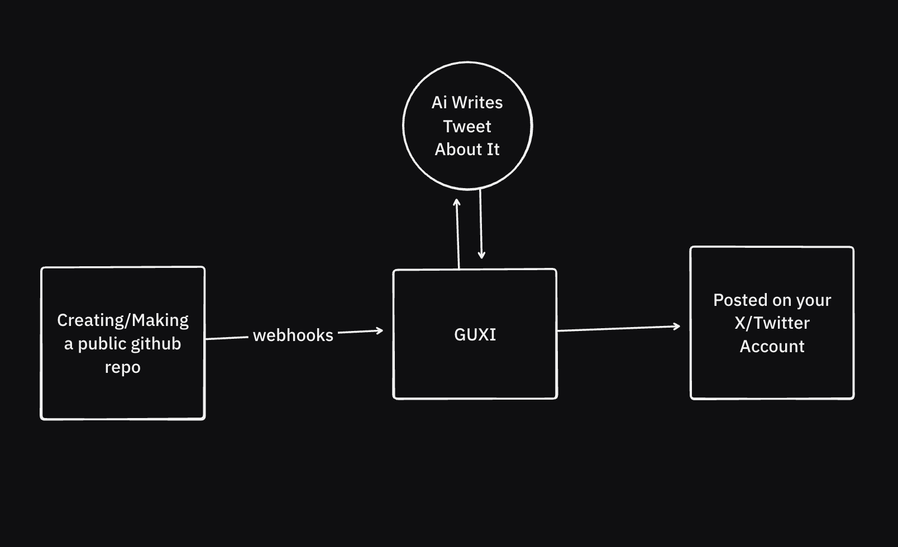

# Guxi

Guxi is an application that automatically announces your new public GitHub repositories on your X/Twitter account using AI-generated content.



## How it Works

1.  When you create a new public repository on GitHub, a webhook is sent to Guxi.
2.  Guxi receives the webhook and uses the OpenRouter API to generate a tweet about your new project.
3.  The generated tweet is automatically posted to the X/Twitter account you've connected.

## Features

-   **Automated Tweets:** Never forget to announce your new projects again.
-   **AI-Powered Content:** Leverages AI to create engaging and relevant tweets.
-   **GitHub Integration:** Seamlessly connects to your GitHub account via a GitHub App.
-   **X/Twitter Integration:** Posts directly to your X/Twitter profile.

## Tech Stack

-   **Framework:** [Next.js](https://nextjs.org/)
-   **Authentication:** [better-auth](https://www.better-auth.com/)
-   **ORM:** [Drizzle ORM](https://orm.drizzle.team/)
-   **Database:** [PostgreSQL](https://www.postgresql.org/)
-   **UI:** [Shadcn UI](https://ui.shadcn.com/), [Tailwind CSS](https://tailwindcss.com/)
-   **AI:** [OpenRouter](https://openrouter.ai/)

## Getting Started

Follow these instructions to get a local copy up and running for development and testing purposes.

### Prerequisites

-   [Node.js](https://nodejs.org/en/) (v20 or later)
-   [pnpm](https://pnpm.io/)
-   A [PostgreSQL](https://www.postgresql.org/) database.

### Installation

1.  **Clone the repository:**
    ```bash
    git clone https://github.com/your-username/guxi.git
    cd guxi
    ```

2.  **Install dependencies:**
    ```bash
    pnpm install
    ```

3.  **Set up environment variables:**
    -   Copy the `.env.example` file to a new file named `.env`.
    -   ```bash
        cp .env.example .env
        ```
    -   Fill in the required values in the `.env` file. See the [Environment Variables](#environment-variables) section for more details.

4.  **Run database migrations:**
    -   Make sure your PostgreSQL database is running and the `DATABASE_URL` in your `.env` is correct.
    -   Run the following command to apply the database schema:
    ```bash
    pnpm drizzle-kit push:pg
    ```
    *Note: `drizzle-kit` is used directly as there is no package.json script.*

5.  **Run the development server:**
    ```bash
    pnpm dev
    ```
    The application should now be running on [http://localhost:3000](http://localhost:3000).

## Environment Variables

You'll need to create a GitHub App and an X/Twitter App to get the necessary credentials.

| Variable                 | Description                                                                                             |
| ------------------------ | ------------------------------------------------------------------------------------------------------- |
| `X_API_KEY`              | The API Key for your X/Twitter App.                                                                     |
| `X_API_SECRET`           | The API Key Secret for your X/Twitter App.                                                              |
| `X_CLIENT_ID`            | The Client ID for your X/Twitter App.                                                                   |
| `X_CLIENT_SECRET`        | The Client Secret for your X/Twitter App.                                                               |
| `GITHUB_CLIENT_ID`       | The Client ID of your GitHub App.                                                                       |
| `GITHUB_CLIENT_SECRET`   | The Client Secret of your GitHub App.                                                                   |
| `GITHUB_WEBHOOK_SECRET`  | The webhook secret for your GitHub App.                                                                 |
| `DATABASE_URL`           | The connection string for your PostgreSQL database.                                                     |
| `NEXT_PUBLIC_APP_URL`    | The public URL of your application (e.g., `http://localhost:3000`).                                     |
| `GITHUB_APP_ID`          | The App ID of your GitHub App.                                                                          |
| `BETTER_AUTH_URL`        | The URL for your better-auth instance. For local development this is `http://localhost:3000`.           |
| `GITHUB_APP_PRIVATE_KEY` | The private key for your GitHub App.                                                                    |
| `OPENROUTER_API_KEY`     | Your API key for [OpenRouter](https://openrouter.ai/).                                                  |
